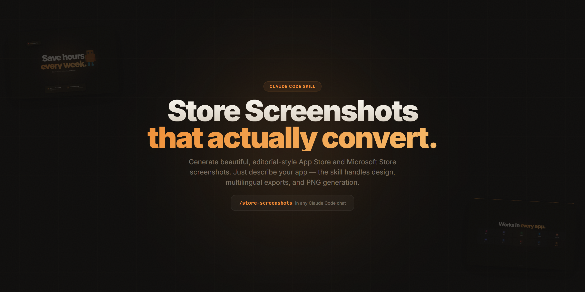
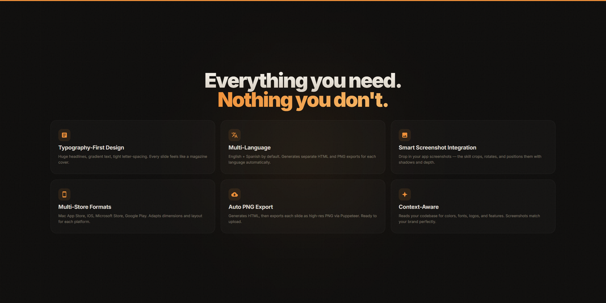
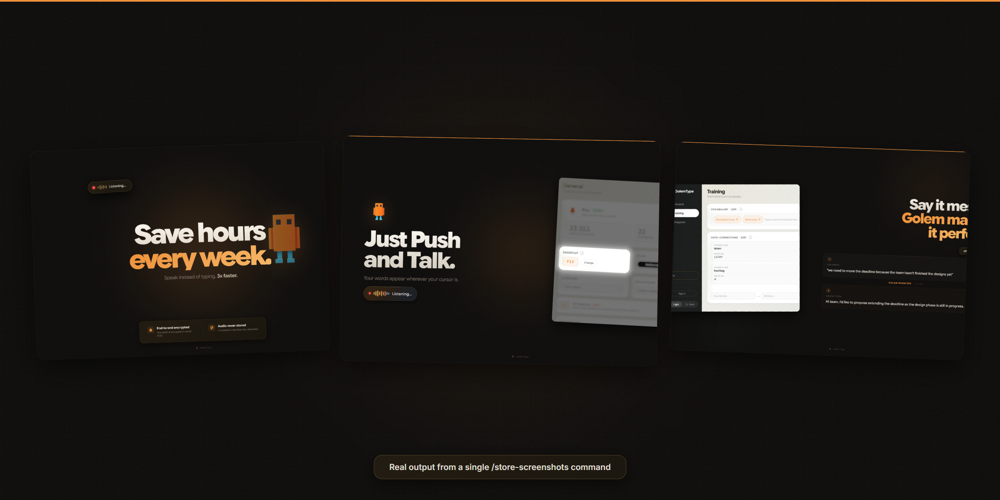
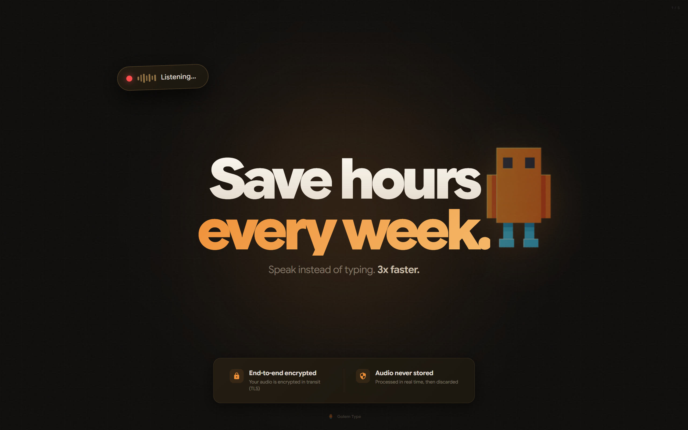
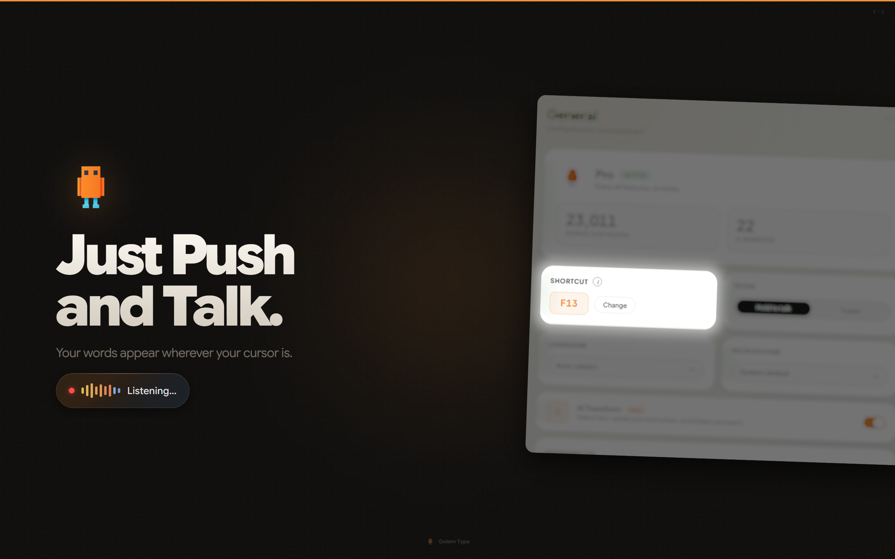
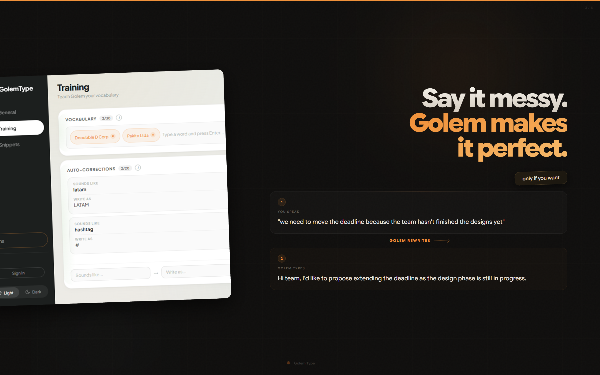
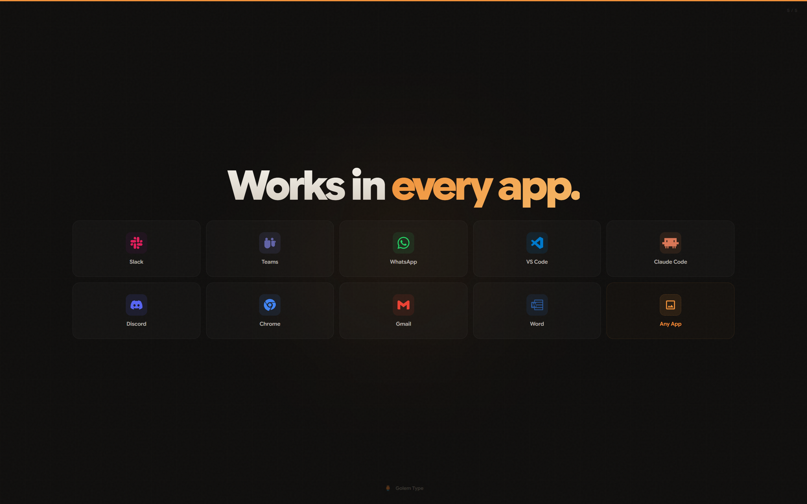
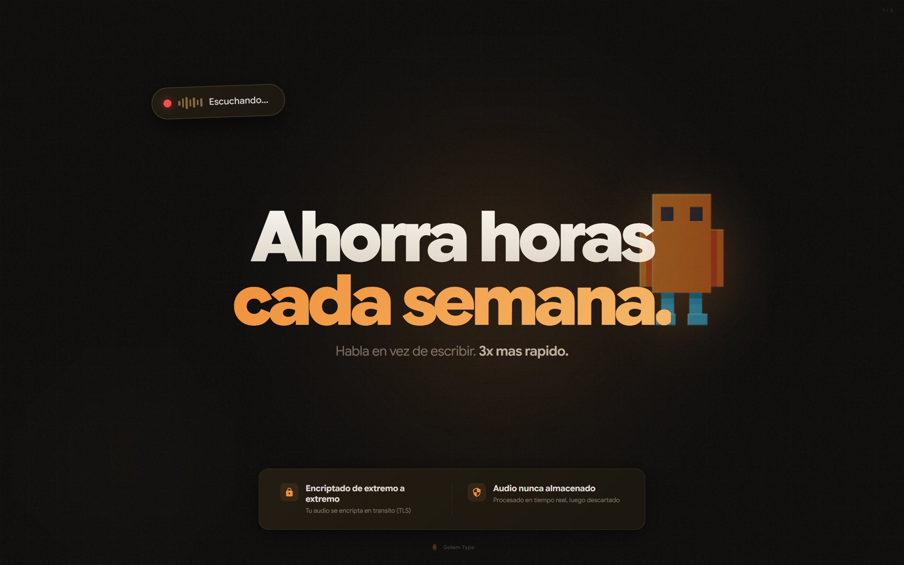

# Store Screenshots

> A Claude Code skill that generates beautiful, editorial-style App Store and Microsoft Store screenshots.



## What it does

Just type `/store-screenshots` in any Claude Code chat. The skill reads your codebase, understands your app's brand (colors, fonts, logos), and generates production-ready store screenshots as HTML, then exports them as high-res PNGs.

**No Figma. No Photoshop. No templates. Just describe your app.**

---



## Features

- **Typography-First Design** — Huge 130-210px headlines with gradient text. Every slide feels like a magazine cover, not a PowerPoint.
- **Multi-Language** — English + Spanish by default. Separate HTML and PNG exports for each language.
- **Smart Screenshot Integration** — Drop in your app screenshots and the skill will crop, rotate, and position them with shadows and depth.
- **Multi-Store Formats** — Mac App Store (2560x1600), iOS (1290x2796), Microsoft Store (1920x1080), Google Play (1024x500).
- **Auto PNG Export** — Generates HTML, then exports each slide as a high-res PNG via Puppeteer. Ready to upload.
- **Context-Aware** — Reads your CSS variables, asset folders, and landing pages to match your brand perfectly.

## Real Output

Screenshots generated for [Golem Type](https://golemtype.com) using a single `/store-screenshots` command:



### Landscape (Mac App Store / Microsoft Store)

| Hero | Push and Talk | AI Rewrite |
|------|---------------|------------|
|  |  |  |

| Works Everywhere | Hero (Spanish) |
|-------------------|----------------|
|  |  |

## Install

Copy the `SKILL.md` file to your Claude Code skills directory:

```bash
# macOS / Linux
mkdir -p ~/.claude/skills/store-screenshots
cp SKILL.md ~/.claude/skills/store-screenshots/

# Windows
mkdir %USERPROFILE%\.claude\skills\store-screenshots
copy SKILL.md %USERPROFILE%\.claude\skills\store-screenshots\
```

Or clone this repo and copy:

```bash
git clone https://github.com/dontoreve/store-screenshots-skill.git
cp store-screenshots-skill/SKILL.md ~/.claude/skills/store-screenshots/
```

## Usage

In any Claude Code chat:

```
/store-screenshots
```

The skill will ask you:

1. **Which store?** — Mac App Store, iOS, Microsoft Store, or Google Play
2. **Languages?** — EN + ES by default, or specify others
3. **App screenshots?** — Reference any screenshots you have
4. **Key features?** — What to highlight in each slide
5. **Brand assets?** — Logo, mascot, primary colors

Then it generates:
- HTML files (one per language) with all slides
- A Puppeteer export script
- Individual PNG files in an exports folder

## Design Philosophy

This skill avoids generic "AI slop" aesthetics. Instead, it follows editorial design principles:

| Principle | Implementation |
|-----------|---------------|
| **Headlines dominate** | 130-210px, weight 800, tight tracking |
| **Elements overlap** | Screenshots peak from edges, capsules float over text |
| **Playful capsules** | Tilted dark pills with gold borders for callouts |
| **Dark backgrounds** | Warm orbs, subtle grid, noise texture |
| **No empty corners** | Everything clusters centrally |
| **Gradient text** | White-to-cream primary, accent color secondary |

## Supported Stores

| Store | Dimensions | Orientation |
|-------|-----------|-------------|
| Mac App Store | 2560 x 1600 | Landscape |
| iOS App Store | 1290 x 2796 | Portrait |
| Microsoft Store | 1920 x 1080 | Landscape |
| Google Play | 1024 x 500 | Landscape |

## Requirements

- [Claude Code](https://claude.ai/code) (CLI, desktop app, or VS Code extension)
- Node.js (for Puppeteer PNG export)

## License

MIT

---

Built with Claude Code by [Antigravity Studio](https://antigravity.studio)
